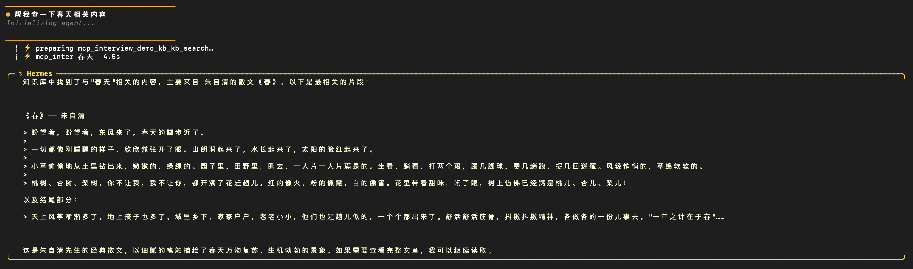
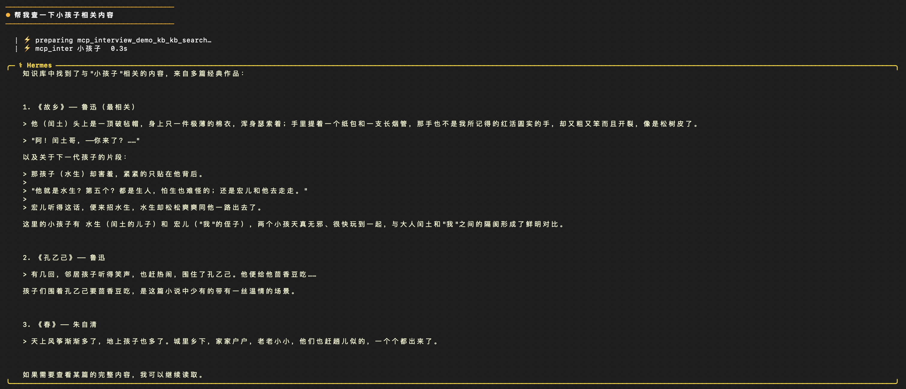
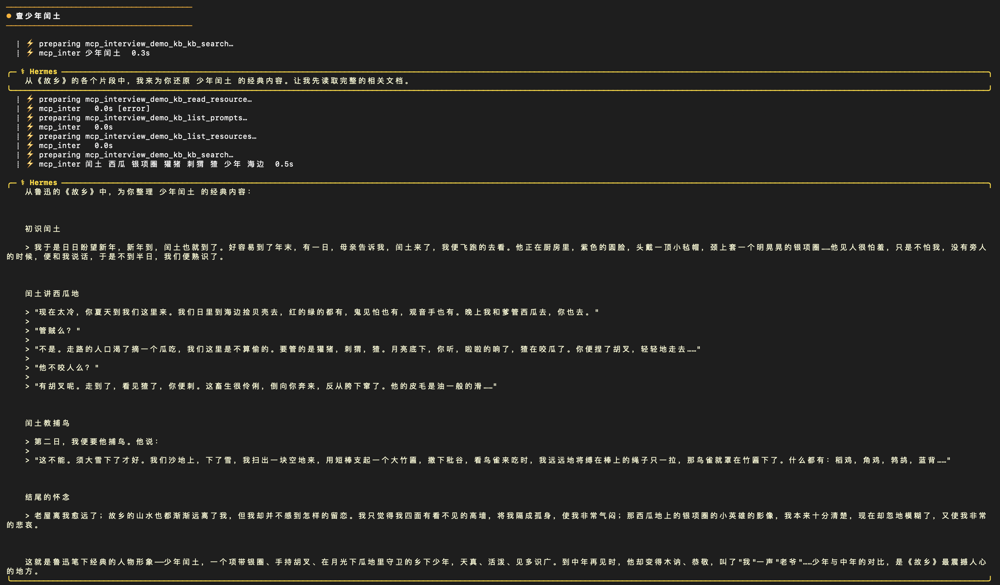
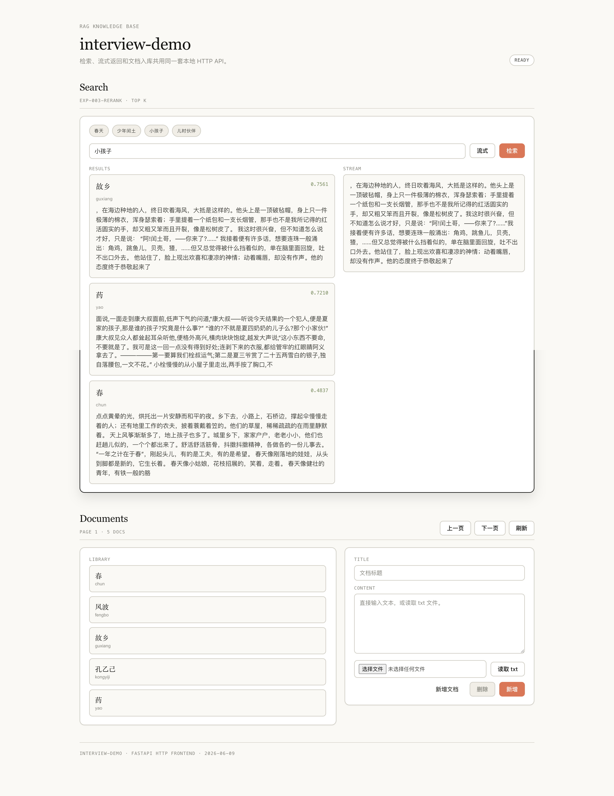
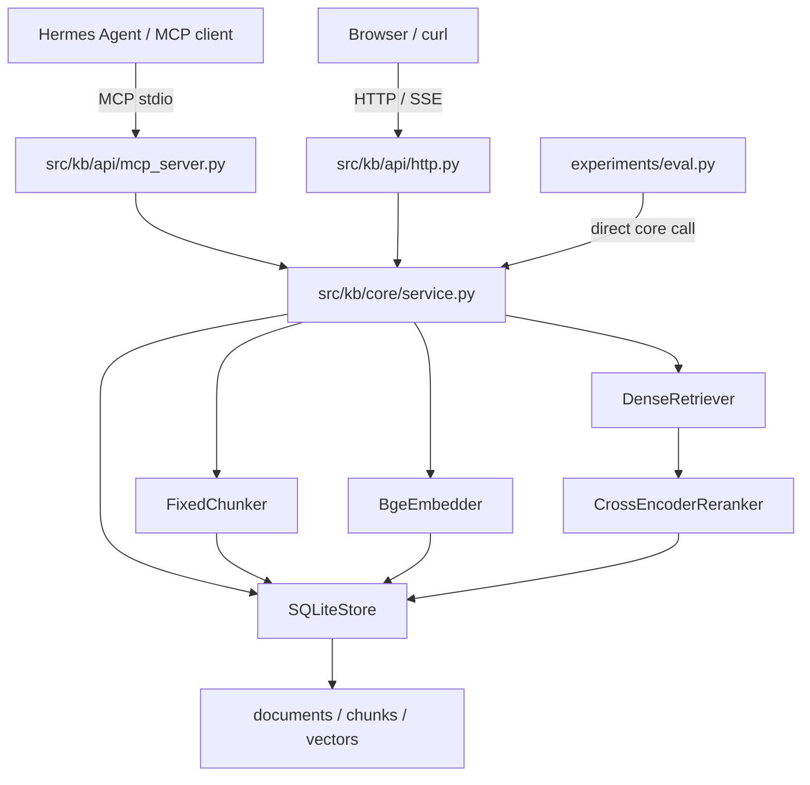

# Knowledge Base Agent with Semantic Search and MCP Tool

一个评测驱动的 RAG 知识库 demo：支持文档 CRUD、分页、直接文本入库、前端读取 `.txt` 入库、中文语义检索、SSE 流式返回，并通过 MCP Server 暴露给 Hermes Agent 等 agent 调用。

设计思路见 [docs/design.md](docs/design.md)，当前状态见 [docs/overview.md](docs/overview.md)。

## Features

- [x] 文档创建、查询、更新、删除
- [x] 文档列表分页查询
- [x] 支持直接输入文本创建知识内容
- [x] 前端支持读取 `.txt` 文件并入库
- [x] 固定长度 chunk 切分
- [x] 使用中文 embedding 生成 chunk 向量
- [x] 使用 numpy 精确 cosine 暴力检索
- [x] 使用 cross-encoder reranker 对 dense top10 重排序
- [x] 支持语义检索，例如“小孩子”可召回《故乡》
- [x] 支持 SSE 逐字流式返回 top snippet
- [x] 提供 MCP Server，Agent 可调用 `kb_search`
- [x] MCP 工具描述通过 `list_tools` 下发，引导 agent 直接调用工具
- [x] 基本错误处理：空 query、空文档、知识库为空、检索失败、工具超时等

## Screenshots









## Architecture



评测直接调用 core library，不经过 HTTP/MCP；HTTP 和 MCP 都是薄适配层。

## Tech Stack

| Layer | Implementation |
|---|---|
| Language | Python 3.11+ |
| HTTP | FastAPI + uvicorn |
| Frontend | 单文件 HTML/CSS/JS，零前端依赖 |
| Storage | SQLite |
| Vector store | SQLite 持久化向量 + numpy 精确 cosine 暴力检索 |
| Embedding | `BAAI/bge-small-zh-v1.5` |
| Reranker | `BAAI/bge-reranker-base` |
| Streaming | Server-Sent Events |
| Agent tool | MCP Server / FastMCP |
| Evaluation | `experiments/eval.py` + golden set + leaderboard |

## Project Structure

```text
interview-demo/
├── src/kb/
│   ├── api/
│   │   ├── http.py              # FastAPI: CRUD / search / SSE / frontend
│   │   ├── mcp_server.py        # MCP tool: kb_search
│   │   └── static/index.html    # minimal frontend
│   ├── core/
│   │   ├── service.py           # pure library facade
│   │   ├── chunkers.py          # fixed chunking
│   │   ├── embedders.py         # bge embedding
│   │   ├── retrievers.py        # dense exact cosine retrieval
│   │   └── rerankers.py         # cross-encoder rerank
│   └── store/sqlite_repo.py     # documents / chunks / vectors
├── experiments/
│   ├── configs/                 # experiment configs
│   ├── golden/                  # corpus + query set
│   ├── results/                 # result json + leaderboard
│   └── eval.py                  # offline evaluation
├── scripts/mcp_smoke.py         # MCP protocol smoke test
├── docs/
│   ├── design.md
│   ├── overview.md
│   └── assets/screenshots/
└── README.md
```

## Quick Start

### 1. Install

```bash
python3 -m venv .venv
.venv/bin/python -m pip install -e .
```

首次运行检索或评测会下载 `BAAI/bge-small-zh-v1.5` 和 `BAAI/bge-reranker-base`。模型缓存后可离线重跑。

### 2. Run Evaluation

```bash
.venv/bin/python experiments/eval.py --config experiments/configs/exp-000-baseline-longcontext.yaml
.venv/bin/python experiments/eval.py --config experiments/configs/exp-001-dense-only.yaml
.venv/bin/python experiments/eval.py --config experiments/configs/exp-002-query-instruction.yaml
.venv/bin/python experiments/eval.py --config experiments/configs/exp-003-rerank.yaml
```

当前 leaderboard 与每个实验决策见 [experiments/results/leaderboard.md](experiments/results/leaderboard.md)。

### 3. Start HTTP Service

```bash
.venv/bin/python -m uvicorn kb.api.http:app --host 127.0.0.1 --port 8000
```

浏览器访问：

```text
http://127.0.0.1:8000/
```

### 4. MCP Smoke Test

```bash
.venv/bin/python scripts/mcp_smoke.py 春天 --top-k 3
.venv/bin/python scripts/mcp_smoke.py 小孩子 --top-k 3
```

该脚本走真实 MCP stdio 协议：`initialize -> list_tools -> call_tool(kb_search)`，不是 direct import。

## HTTP API

### Create Document

```http
POST /documents
```

```json
{
  "title": "测试文档",
  "content": "这里是一段直接输入的知识内容。"
}
```

说明：HTTP API 接收 JSON 文本；前端的 `.txt` 上传是浏览器读取 txt 后调用此接口入库，当前没有单独的 multipart upload endpoint。

### List Documents

```http
GET /documents?page=1&size=20
```

```json
{
  "items": [
    {"id": "chun", "title": "春", "content": "..."}
  ],
  "page": 1,
  "size": 20,
  "total": 5
}
```

### Get / Update / Delete Document

```http
GET /documents/{doc_id}
PUT /documents/{doc_id}
DELETE /documents/{doc_id}
```

### Semantic Search

```http
POST /search
```

```json
{
  "query": "小孩子",
  "top_k": 3
}
```

Response:

```json
{
  "query": "小孩子",
  "results": [
    {
      "doc_id": "guxiang",
      "title": "故乡",
      "chunk_id": "guxiang:6",
      "snippet": "...",
      "score": 0.7561
    }
  ]
}
```

该接口使用 embedding 语义召回 + reranker 重排序，因此 query 不需要和原文完全字面重合。

### Streaming Search with SSE

```http
GET /search/stream?q=春天&top_k=1
```

SSE response:

```text
data: ...

data: [DONE]
```

SSE 只负责流式传输。当前实现默认将检索到的 top snippet 逐字返回，不依赖 LLM；如需总结型答案，可在此接口后续接入 LLM generator。

## MCP Tool

MCP server 启动命令：

```bash
PYTHONPATH=src .venv/bin/python -m kb.api.mcp_server
```

必须用 `-m` 模块方式启动。直接执行 `src/kb/api/mcp_server.py` 会让本地 `http.py` 遮蔽标准库 `http`，导致启动失败。

Tool:

```text
kb_search(query: str, top_k: int = 5)
```

Input:

```json
{
  "query": "春天",
  "top_k": 5
}
```

Output:

```json
{
  "ok": true,
  "results": [
    {
      "doc_id": "chun",
      "title": "春",
      "chunk_id": "chun:0",
      "snippet": "...",
      "score": 0.98
    }
  ]
}
```

错误返回：

```json
{
  "ok": false,
  "error": {
    "code": "EMPTY_QUERY",
    "message": "EMPTY_QUERY"
  },
  "results": []
}
```

## Hermes Agent Usage

Hermes config 示例：

```yaml
mcp_servers:
  interview-demo-kb:
    command: /Users/mac/studyspace/interview-demo/.venv/bin/python
    args:
      - -m
      - kb.api.mcp_server
    env:
      PYTHONPATH: /Users/mac/studyspace/interview-demo/src
    connect_timeout: 30
    timeout: 60
    tools:
      include:
        - kb_search
```

修改 `mcp_server.py` 后，在 Hermes 中执行：

```text
/reload-mcp
```

用户输入：

```text
帮我在知识库中查一下春天相关内容
```

Agent 应调用 MCP tool：

```json
{
  "tool": "mcp_interview_demo_kb_kb_search",
  "arguments": {
    "query": "春天",
    "top_k": 5
  }
}
```

MCP tool 返回结构化检索结果，Agent 负责组织自然语言答案。

## Demo Cases

| Query | Expected top document | Why |
|---|---|---|
| `春天` | `chun` / 《春》 | 主题与原文高度相关 |
| `少年闰土` | `guxiang` / 《故乡》 | 实体精确命中 |
| `小孩子` | `guxiang` / 《故乡》 | 零字面重合/弱字面重合的语义查询 |
| `儿时伙伴` | `guxiang` / 《故乡》 | semantic stress set |

Demo corpus:

- `experiments/golden/corpus/chun.txt`
- `experiments/golden/corpus/guxiang.txt`
- `experiments/golden/corpus/distractors/*.txt`

## Error Handling

| code | 场景 |
|---|---|
| `EMPTY_QUERY` | query 去空白后为空 |
| `KB_NOT_FOUND` | 知识库内无文档 |
| `EMBEDDING_FAILED` | embedding 模型调用失败 |
| `VECTOR_SEARCH_FAILED` | 向量检索或 rerank 失败 |
| `TOOL_TIMEOUT` | MCP 工具调用超时 |
| `RETRIEVAL_FAILED` | MCP 未分类兜底异常 |
| `NO_RELEVANT_RESULT` | top 分低于相关性阈值 |
| `EMPTY_TITLE` | 入库标题为空 |
| `EMPTY_DOCUMENT` | 入库内容为空 |
| `DOCUMENT_NOT_FOUND` | 操作不存在的文档 |
| `BAD_PAGINATION` | page/size 非法 |
| `UNSUPPORTED_FILE_TYPE` | 前端读取了非 `.txt` 文件 |

全量错误码契约见 [docs/overview.md](docs/overview.md)。

## Retrieval Strategy

Current implementation:

1. 文档入库时按固定长度切分 chunk。
2. 使用 `BAAI/bge-small-zh-v1.5` 对 chunk 生成 embedding。
3. 查询时对 query 生成 embedding。
4. 使用 numpy 精确 cosine 暴力召回 dense topK。
5. 使用 `BAAI/bge-reranker-base` 对候选 chunk 重排序。
6. 返回 chunk 级结果，并保留 `doc_id` / `title` / `score` / `snippet`。

Not enabled by default:

- query expansion
- HyDE
- 文档摘要/关键词/实体增强索引
- ANN 向量库
- LLM 生成式答案

这些增强项不是没有价值，而是当前评测显示 `exp-003-rerank` 已覆盖 demo 和 semantic stress set；未被评测失败指向的组件暂不加入默认链路。

## Engineering Design

- Core library first：`KnowledgeService` 是纯库，HTTP 和 MCP 只是适配层。
- Strategy-style components：chunker / embedder / retriever / reranker 可替换，实验配置决定组装方式。
- Repository boundary：`SQLiteStore` 隔离文档、chunk 和向量持久化。
- Adapter layer：`mcp_server.py` 将 core search 适配成 agent 可调用工具。
- Evaluation-driven iteration：每个实验进入 [experiments/results/leaderboard.md](experiments/results/leaderboard.md)，并带保留/回滚决策。

## Limitations and Future Work

Limitations:

- 当前只支持直接文本和前端 `.txt` 读取。
- SSE 当前流式输出检索 snippet，不默认调用 LLM 生成总结。
- 当前是单知识库 demo，没有鉴权、多用户和权限隔离。
- 当前向量检索使用精确暴力搜索，适合小规模 demo，不面向百万级语料。

Future work:

- 支持 PDF / DOCX / Markdown 入库。
- 接入 LLM generator，实现 RAG 总结型流式回答。
- 支持多知识库和权限隔离。
- 支持更大规模向量索引，如 FAISS / pgvector。
- 加入检索日志和用户反馈闭环。

## Delivery

提交包命名要求来自 [docs/requirement.md](docs/requirement.md)：

```text
姓名-学校-2026-06-09-Agent
```

打包前把最新简历放入同名目录，并排除 `.venv/`、`.data/`、`__pycache__/`、`*.pyc` 等本地运行产物。
